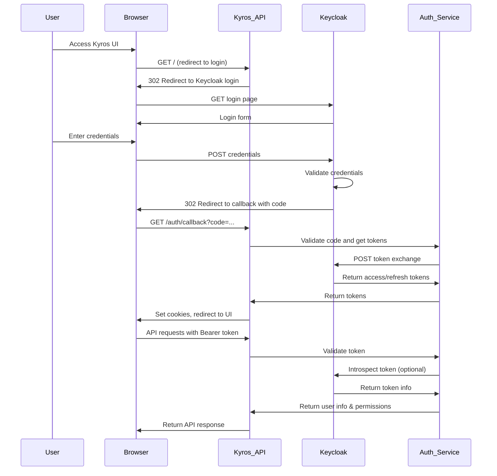
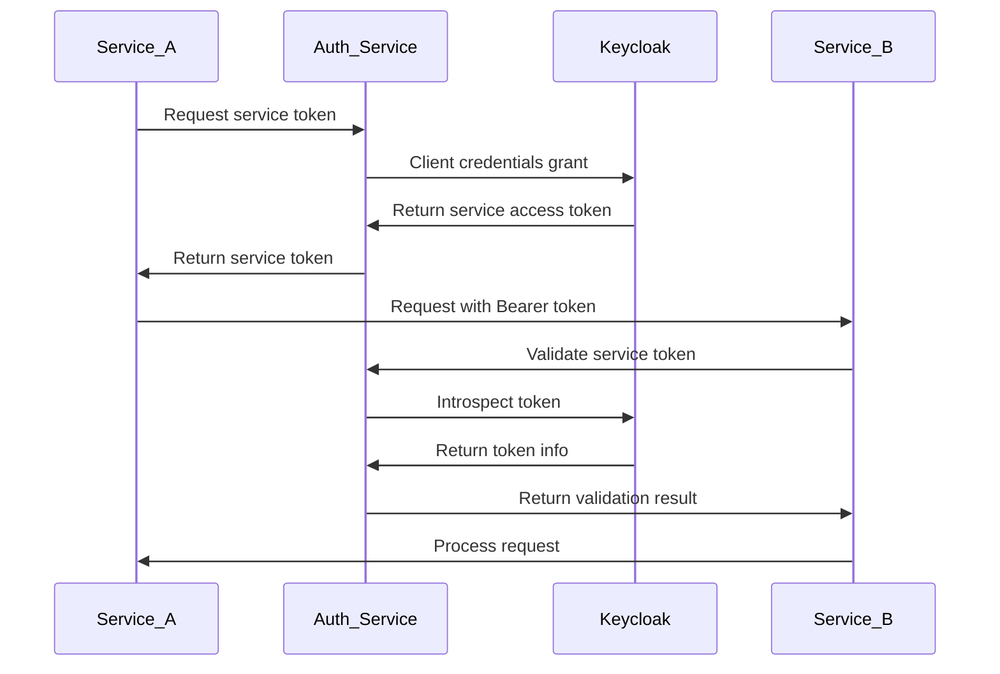
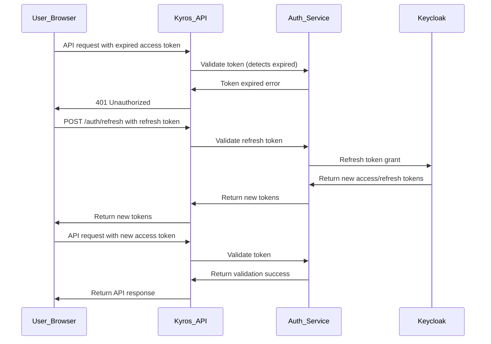
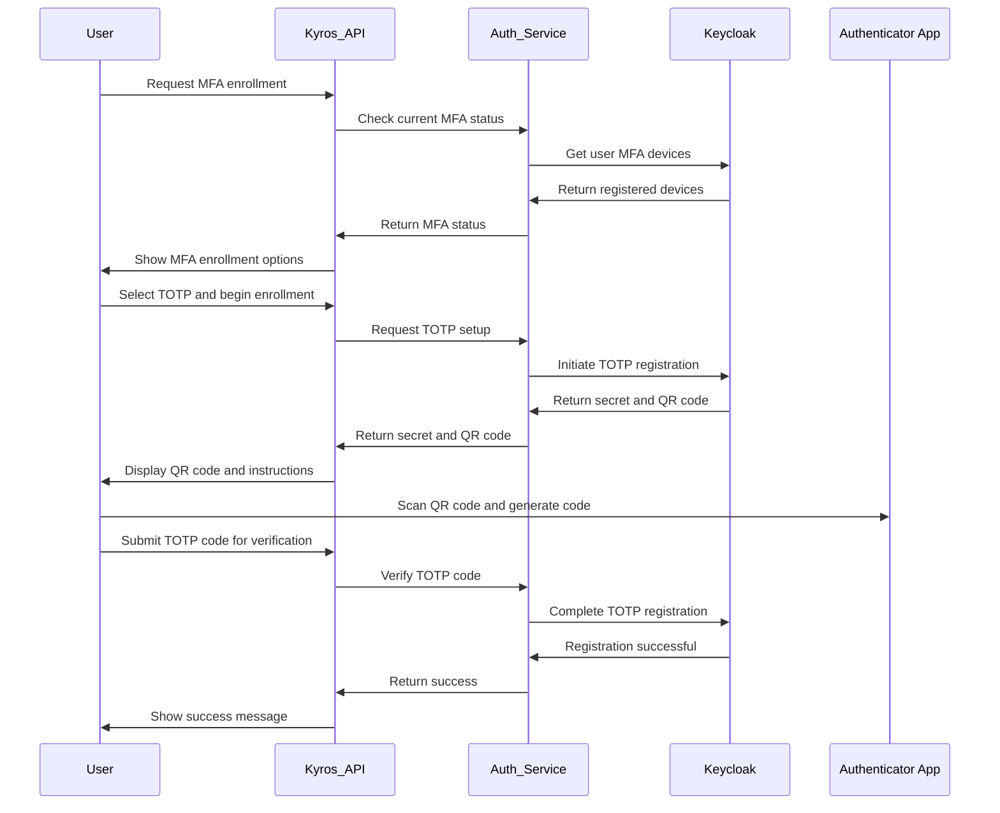
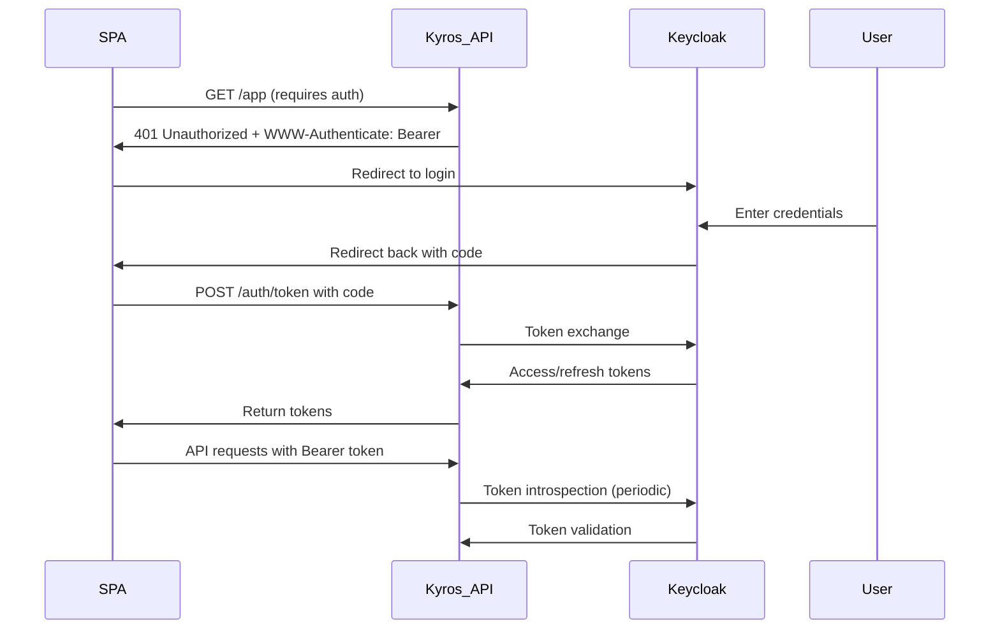
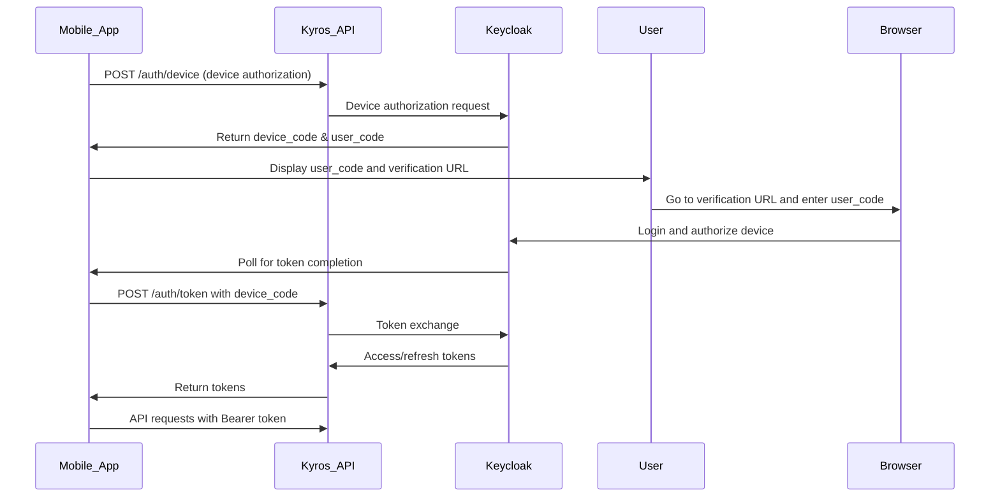
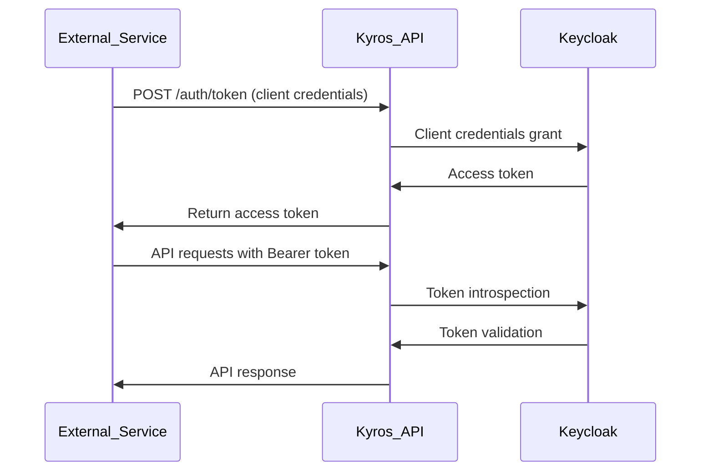
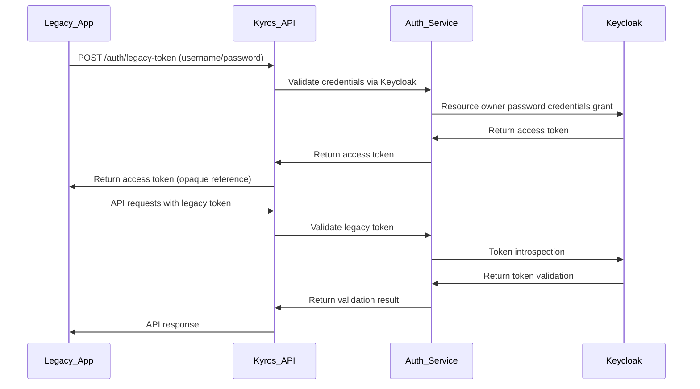
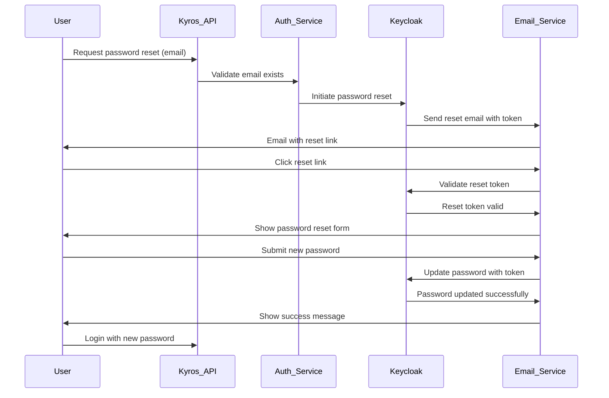

# Kyros Authentication Architecture

## Overview
Kyros implements a robust authentication and authorization system built around industry-standard protocols and technologies. The system is designed to provide secure, scalable, and flexible identity management while supporting various authentication methods and integration scenarios.

## Core Components

### 1. Keycloak Integration
Kyros uses Keycloak as its primary Identity and Access Management (IAM) solution, providing:
- OpenID Connect (OIDC) and OAuth 2.0 compliance
- SAML 2.0 support for enterprise SSO
- LDAP/Active Directory integration
- Social login providers (GitHub, Google, etc.)
- Multi-factor authentication (MFA)
- User federation and identity brokering
- Session management
- Token issuance and validation

### 2. Kyros Authentication Service
A lightweight service that acts as an intermediary between Kyros services and Keycloak:
- Token validation and introspection
- User information caching
- Permission mapping
- Service-to-service authentication
- Audit logging of authentication events

### 3. JWT Token Standards
Kyros follows JWT best practices for secure token handling:
- Short-lived access tokens (15 minutes)
- Refresh token rotation
- Token revocation capabilities
- Audience and issuer validation
- Signature verification using JWKS
- Claims-based authorization

## Authentication Flows

### 1. User Login Flow (Authorization Code Grant)


### 2. Service-to-Service Authentication


### 3. Token Refresh Flow


## Token Types and Claims

### Access Token
Short-lived JWT used for authenticating requests to Kyros services:

**Header**:
```json
{
  "alg": "RS256",
  "typ": "JWT",
  "kid": "keycloak-key-id"
}
```

**Payload**:
```json
{
  "iss": "https://keycloak.kyros.example.com/realms/kyros",
  "sub": "user-uuid",
  "aud": "account",
  "exp": 1735651200,
  "iat": 1735645800,
  "auth_time": 1735645800,
  "typ": "Bearer",
  "azp": "kyros-api",
  "session_state": "session-uuid",
  "acr": "1",
  "allowed-origins": [
    "https://kyros.example.com"
  ],
  "realm_access": {
    "roles": [
      "offline_access",
      "uma_authorization"
    ]
  },
  "resource_access": {
    "kyros-api": {
      "roles": [
        "user",
        "repository:read",
        "repository:write"
      ]
    }
  },
  "scope": "openid profile email roles",
  "email_verified": true,
  "name": "John Doe",
  "preferred_username": "johndoe",
  "given_name": "John",
  "family_name": "Doe",
  "email": "john.doe@example.com"
}
```

### Refresh Token
Long-lived token used to obtain new access tokens:
- Opaque string (not JWT) stored securely in database
- Rotated on each use to prevent replay attacks
- Revocable individually or in batches
- Typically valid for 30 days

### Service Token
Used for service-to-service authentication:
- Issued via client credentials grant
- Short-lived (15 minutes)
- Contains service identity and permissions
- Audience restricted to specific services

## Authorization Model

### Role-Based Access Control (RBAC)
Kyros implements a flexible RBAC model with hierarchical roles:

#### Realm Roles (Global)
- `admin`: Full system access
- `platform-admin`: Platform management (no user management)
- `tenant-admin`: Tenant-specific administration
- `repository-admin`: Repository-specific administration
- `developer`: Standard developer permissions
- `viewer`: Read-only access
- `scanner`: Automated scanning permissions
- `webhook-manager`: Webhook configuration permissions

#### Client Roles (Service-Specific)
- `kyros-api`: Permissions for API service
- `kyros-registry`: Permissions for registry service
- `kyros-trustscore`: Permissions for trust score service
- `kyros-webhook`: Permissions for webhook service
- `kyros-operator`: Permissions for operator service

### Permission Granularity
Permissions are defined at multiple levels:

#### System-Level Permissions
- `user:create`, `user:read`, `user:update`, `user:delete`
- `group:create`, `group:read`, `group:update`, `group:delete`
- `role:create`, `role:read`, `role:update`, `role:delete`
- `client:create`, `client:read`, `client:update`, `client:delete`
- `tenant:create`, `tenant:read`, `tenant:update`, `tenant:delete`

#### Namespace-Level Permissions
- `namespace:create`, `namespace:read`, `namespace:update`, `namespace:delete`
- `namespace:quota:read`, `namespace:quota:update`

#### Repository-Level Permissions
- `repository:create`, `repository:read`, `repository:update`, `repository:delete`
- `repository:push`, `repository:pull`
- `repository:tag:create`, `repository:tag:delete`
- `repository:blob:read`, `repository:blob:delete`

#### Artifact-Level Permissions
- `artifact:read`, `artifact:delete`
- `artifact:trust:read`
- `artifact:vulnerability:read`
- `artifact:sbom:read`
- `artifact:signature:read`, `artifact:signature:create`

#### Policy-Level Permissions
- `policy:create`, `policy:read`, `policy:update`, `policy:delete`
- `policy:evaluate`

#### Webhook-Level Permissions
- `webhook:create`, `webhook:read`, `webhook:update`, `webhook:delete`
- `webhook:trigger`

#### Observability-Level Permissions
- `metrics:read`
- `logs:read`, `logs:export`
- `traces:read`
- `alerts:read`, `alerts:update`
- `alert-rules:create`, `alert-rules:read`, `alert-rules:update`, `alert-rules:delete`

### Policy-Based Access Control (PBAC)
For complex authorization decisions, Kyros integrates with Open Policy Agent (OPA):

#### Policy Decision Points
1. **API Gateway**: Initial authorization check
2. **Service Level**: Fine-grained authorization within services
3. **Data Access Layer**: Row-level security for database queries

#### Policy Structure (Rego Example)
```rego
package kyros.authz

default allow = false

allow {
    input.method == "GET"
    input.path = ["api", "v1", "repositories"]
    has_repository_read_access(input)
}

allow {
    input.method == "POST"
    input.path = ["api", "v1", "repositories"]
    has_repository_create_access(input)
}

has_repository_read_access(input) {
    token := input.token
    repository_id := input.repository_id
    
    # Check if user has repository:read permission
    token.resource_access.kyros-api[_] == "repository:read"
    
    # Check if user has access to the specific repository
    data.user_repositories[token.sub][repository_id]
}

has_repository_create_access(input) {
    token := input.token
    namespace_id := input.namespace_id
    
    # Check if user has repository:create permission
    token.resource_access.kyros-api[_] == "repository:create"
    
    # Check if user has access to the namespace
    data.user_namespaces[token.sub][namespace_id]
}
```

## Token Validation and Introspection

### Local JWT Validation
Services validate JWT tokens locally when possible:
1. **Signature Verification**: Using Keycloak's public JWKS
2. **Expiration Check**: Verify `exp` claim is in future
3. **Issuer Validation**: Verify `iss` claim matches Keycloak realm
4. **Audience Validation**: Verify `aud` claim includes service client ID
5. **Required Claims**: Verify presence of `sub`, `iat`, `typ`

### Remote Token Introspection
For sensitive operations or when local validation insufficient:
1. **Token Introspection Endpoint**: POST to Keycloak's `/protocol/openid-connect/token/introspect`
2. **Client Authentication**: Service authenticates with Keycloak using service account
3. **Response**: Returns active state and token claims
4. **Caching**: Results cached briefly to reduce Keycloak load

### Token Revocation Detection
Kyros handles token revocation through:
1. **Revocation Endpoints**: Services can check Keycloak's revocation status
2. **Short Expiration**: Limits window of vulnerability for stolen tokens
3. **Refresh Token Rotation**: Detects refresh token reuse
4. **Session Invalidation**: Keycloak admin actions invalidate sessions

## Session Management

### Web Sessions
For browser-based access to Kyros UI:
1. **Authentication**: Via Keycloak login page
2. **Session Cookie**: Encrypted session cookie stored in browser
3. **Server-Side Session**: Optional server-side session storage in Redis
4. **Session Timeout**: Configurable idle and absolute timeouts
5. **Single Sign-Out**: Support for SLO protocols

### API Sessions
For programmatic access:
1. **Stateless**: JWT tokens contain all necessary information
2. **Refresh Tokors**: Used to obtain new access tokens without re-authentication
3. **Token Binding**: Optional token binding to client IP or user agent
4. **Device Management**: Tracking of active sessions per user

## Multi-Factor Authentication (MFA)

### Supported MFA Methods
1. **Time-Based One-Time Password (TOTP)**: Google Authenticator, Authy, etc.
2. **WebAuthn**: Hardware security keys (YubiKey, Titan Security Key)
3. **SMS OTP**: One-time passwords via SMS
4. **Email OTP**: One-time passwords via email
5. **Duo Security**: Duo Push, phone callback, etc.

### MFA Enrollment Flow


### MFA Authentication Flow
When MFA is required:
1. User enters username/password
2. Keycloak detects MFA requirement
3. User prompted for MFA challenge (TOTP code, WebAuthn, etc.)
4. Upon successful MFA, Keycloak proceeds with standard token issuance

## Social Login and Identity Brokering

### Supported Identity Providers
1. **GitHub**: OAuth 2.0 integration
2. **Google**: OpenID Connect integration
3. **GitLab**: OAuth 2.0 integration
4. **Microsoft Azure AD**: OpenID Connect and SAML
5. **SAML 2.0**: Generic SAML identity providers
6. **LDAP/Active Directory**: Direct federation

### Account Linking
Users can link multiple identities to a single Kyros account:
1. **Primary Authentication**: Initial login via any supported method
2. **Account Linking**: Option to link additional identities in profile
3. **Verification**: Verify ownership of secondary identity
4. **Unified Profile**: Single user profile with multiple linked identities
5. **Fallback Authentication**: Ability to authenticate with any linked identity

## Service Accounts and Machine-to-Machine Authentication

### Service Account Creation
1. **Manual Creation**: Administrators create service accounts via API/UI
2. **Automatic Creation**: Kyros Operator creates service accounts for components
3. **Limited Scope**: Service accounts granted minimal necessary permissions
4. **Credential Management**: Secure storage of service account credentials

### Authentication Methods for Services
1. **Client Credentials Grant**: Standard OAuth 2.0 for service-to-service
2. **JWT Bearer Assertion**: Service signs JWT with private key
3. **API Keys**: Long-lived keys for simple service authentication
4. **Mutual TLS**: Certificate-based authentication for high-security scenarios

### Service Account Lifecycle
1. **Provisioning**: Create service account with specific roles/permissions
2. **Credential Distribution**: Securely provide credentials to service
3. **Usage Monitoring**: Track service account usage and access patterns
4. **Rotation**: Periodic credential rotation
5. **Deprovisioning**: Revoke access and delete when no longer needed

## Security Considerations

### Token Security
1. **Short Lifespan**: Access tokens limited to 15 minutes
2. **Secure Storage**: Refresh tokens encrypted at rest
3. **Rotation**: Refresh tokens rotated on use
4. **Revocation**: Immediate revocation capability
5. **Binding**: Optional token binding to client characteristics
6. **Encryption**: JWTs signed but not encrypted (sensitive info in claims limited)

### Protection Against Common Attacks
1. **Token Replay**: Short expiration and nonce usage
2. **Token Theft**: Short lifespan limits damage; refresh token rotation
3. **Man-in-the-Middle**: TLS enforcement for all communications
4. **Brute Force**: Rate limiting on authentication endpoints
5. **Credential Stuffing**: Multi-factor authentication and CAPTCHA
6. **Session Fixation**: Secure session cookie settings
7. **CSRF**: SameSite cookie attributes and CSRF tokens for forms
8. **Clickjacking**: X-Frame-Options and CSP headers

### Keycloak Security Configuration
1. **Realm Settings**:
   - Token timeout: 15 minutes access, 30 days refresh
   - Refresh token max reuse: 1
   - SSO session idle: 30 minutes
   - SSO session max: 10 hours
   - Offline session idle: 30 days
   - Offline session max: 60 days
  
2. **Client Settings**:
   - Access type: confidential (for services), public (for browsers)
   - Standard flow enabled
   - Direct access grants disabled (unless required)
   - Service accounts enabled
   - Authorization services enabled
  
3. **Authentication Flow**:
   - Browser flow: Username/password → OTP → WebAuthn (optional)
   - Direct grant flow: Disabled for security
   - Reset credentials: Requires email verification
  
4. **Tokens**:
   - Signature algorithm: RS256
   - Public key rotation: Regular key rotation
   - Token encryption: Not used (JWTs signed only)
  
5. **Sessions**:
   - Stateless: False (server-side sessions for web)
   - Session code reuse: Disabled
   - Offline session: Enabled for refresh tokens

## Integration Patterns

### 1. Browser Applications (SPA)


### 2. Mobile/Native Applications


### 3. Server-to-Server Integration


### 4. Legacy Application Integration
For applications that cannot handle JWT tokens:


## Password Policies and Security

### Password Requirements
Kyros enforces strong password policies through Keycloak:
1. **Minimum Length**: 12 characters
2. **Complexity**: Require uppercase, lowercase, numbers, special characters
3. **History**: Remember last 5 passwords to prevent reuse
4. **Expiration**: Passwords expire every 90 days (configurable)
5. **Lockout**: Temporary lockout after 5 failed attempts
6. **Breach Detection**: Check against known breach databases (HaveIBeenPwned)

### Password Reset Flow


## Account Security Features

### Account Lockout
1. **Failed Login Attempts**: Temporary lockout after 5 consecutive failures
2. **Lockout Duration**: 15 minutes initially, increasing with repeated offenses
3. **Administrative Unlock**: Administrators can manually unlock accounts
4. **Audit Logging**: All lockout events logged for security monitoring

### Compromised Credential Detection
1. **Breach Database Checks**: Passwords checked against known breach databases
2. **Leaked Credential Detection**: Automatic detection of leaked credentials
3. **Forced Password Reset**: Users forced to reset password if credentials appear in breach
4. **Notification**: Users notified when their credentials are found in breaches

### Suspicious Activity Monitoring
1. **Impossible Travel**: Detect logins from geographically distant locations
2. **New Device Detection**: Flag logins from unrecognized devices
3. **Unusual Time Access**: Detect access outside normal hours
4. **Failed Attempt Spikes**: Monitor for brute force attack patterns
5. **Session Anomalies**: Detect unusual session characteristics

## Audit and Compliance

### Authentication Audit Events
All authentication-related events are audited:
1. **Login Success/Failure**: Timestamp, IP, user agent, outcome
2. **Logout**: Session termination events
3. **Token Issuance**: Access and refresh token generation
4. **Token Refresh**: Refresh token usage events
5. **Password Changes**: Self-service and administrative password changes
6. **MFA Events**: Enrollment, verification, and removal events
7. **Account Lock/Unlock**: Lockout and unlock events
8. **Consent Updates**: Changes to consented scopes and permissions

### Compliance Reporting
Authentication data supports compliance requirements:
1. **SOC 2**: Access control and identity management evidence
2. **ISO 27001**: User access management controls
3. **GDPR**: Personal data handling in identity management
4. **HIPAA**: Access controls for protected health information
5. **PCI DSS**: Authentication and authorization controls

### Data Retention
Authentication data retention policies:
1. **Login Events**: 2 years for security analysis
2. **Session Data**: Active sessions only; historical sessions purged after 30 days
3. **Token Metadata**: 1 year for audit purposes
4. **MFA Data**: Retained as long as user account exists
5. **Account Lockout Events**: 3 years for security investigations

## Performance and Scalability

### Authentication Performance
1. **Local JWT Validation**: Sub-millisecond validation for most requests
2. **Keycloak Load Reduction**: Local validation reduces Keycloak traffic by ~90%
3. **Caching Layers**: 
   - User information: Redis cache with 5-minute TTL
   - Token introspection: Redis cache with 1-minute TTL
   - Public keys: Memory cache with 24-hour TTL
   - Group membership: Redis cache with 10-minute TTL
4. **Connection Pooling**: Efficient database and Keycloak connections

### Horizontal Scaling
1. **Stateless Validation**: Services can validate tokens can be validated by any service instance
2. **Shared Caching**: Redis cluster for shared cache across service instances
3. **Keycloak Clustering**: Keycloak deployed in clustered mode for HA
4. **Load Balancing**: Traffic distributed across service instances
5. **Database Read Replicas**: Offload read queries from primary database

### Performance Optimization
1. **Token Caching**: Frequently validated tokens cached briefly
2. **Batch Validation**: Validate multiple tokens in single Keycloak call when possible
3. **Asynchronous Validation**: Non-blocking token validation for high-throughput scenarios
4. **Selective Introspection**: Only introspect tokens when local validation insufficient
5. **Prefetching**: Anticipate token validation needs and prefetch data

## Implementation Details

### Kyros Authentication Service
The Auth Service provides these key functions:

#### Token Validation
```go
func ValidateToken(tokenString string) (*TokenClaims, error) {
    // 1. Parse and validate JWT signature
    // 2. Check expiration and issuance times
    // 3. Validate audience and issuer
    // 4. Extract claims
    // 5. Check token revocation status (if required)
    // 6. Return claims or error
}
```

#### Token Introspection
```go
func IntrospectToken(tokenString string) (*TokenInfo, error) {
    // 1. Check cache for recent introspection
    // 2. If not cached or expired, call Keycloak introspection endpoint
    // 3. Authenticate service with Keycloak using service account
    // 4. Parse and return token information
    // 5. Cache result for short period (30 seconds)
}
```

#### User Information Retrieval
```go
func GetUserInfo(userID string) (*UserInfo, error) {
    // 1. Check cache for user information
    // 2. If not cached, retrieve from Keycloak userinfo endpoint
    // 3. Optionally enrich with Kyros-specific data from database
    // 4. Cache result for short period (5 minutes)
}
```

#### Permission Mapping
```go
func GetUserPermissions(userID string) ([]Permission, error) {
    // 1. Get user roles from Keycloak
    // 2. Map roles to Kyros-specific permissions
    // 3. Add any direct permissions from database
    // 4. Return deduplicated permission list
}
```

### Configuration
Authentication service configuration via environment variables:
```env
# Keycloak Connection
KEYCLOAK_URL=https://keycloak.kyros.example.com
KEYCLOAK_REALM=kyros
KEYCLOAK_CLIENT_ID=kyros-auth-service
KEYCLOAK_CLIENT_SECRET=${KEYCLOAK_CLIENT_SECRET}

# Token Validation
TOKEN_VALIDATION_LOCAL=true
TOKEN_INTROSPECTION_CACHE_TTL=30
USER_INFO_CACHE_TTL=300

# Security
TOKEN_BINDING_IP=false
TOKEN_BINDING_USER_AGENT=false
REQUIRE_MFA_FOR_ADMIN=false
PASSWORD_RESET_TOKEN_TTL=3600

# Rate Limiting
AUTH_RATE_LIMIT_ENABLED=true
AUTH_RATE_LIMIT_REQUESTS=10
AUTH_RATE_LIMIT_WINDOW=60  # per minute
```

### Error Handling
Standardized error responses for authentication failures:
```json
{
  "error": {
    "code": "INVALID_CREDENTIALS",
    "message": "Invalid username or password",
    "details": null,
    "request_id": "uuid",
    "timestamp": "ISO-8601 timestamp"
  }
}
```

Other error codes:
- `ACCOUNT_LOCKED`: Account temporarily locked due to failed attempts
- `MFA_REQUIRED`: Multi-factor authentication required
- `PASSWORD_EXPIRED`: Password has expired and must be reset
- `ACCOUNT_DISABLED`: User account has been disabled
- `TOKEN_EXPIRED`: Access token has expired
- `TOKEN_INVALID`: Token signature invalid or malformed
- `TOKEN_REVOKED`: Token has been revoked
- `INSUFFICIENT_PERMISSIONS`: User lacks required permissions
- `SERVICE_UNAVAILABLE`: Authentication service temporarily unavailable

## Future Enhancements

### Planned Improvements
1. **Passwordless Authentication**: WebAuthn/FIDO2 as primary authentication method
2. **Adaptive Authentication**: Risk-based authentication requiring additional factors
3. **Continuous Authentication**: Behavioral biometrics for ongoing verification
4. **Decentralized Identity**: Support for DID (Decentralized Identifiers) and VC (Verifiable Credentials)
5. **Federated Identity Management**: Improved support for complex federation scenarios
6. **Just-In-Time Access**: Temporary elevation of privileges for specific tasks
7. **Privileged Access Management**: Special handling for privileged accounts
8. **Identity Governance**: Automated lifecycle management and access reviews
9. **Behavioral Analytics**: Machine learning for anomaly detection in authentication patterns
10. **Zero Trust Network Integration**: Integration with ZTNA solutions for network-level access control

### Cryptographic Advancements
1. **Post-Quantum Cryptography**: Preparation for quantum-resistant algorithms
2. **Hardware Security Modules**: HSM integration for key protection
3. **Threshold Cryptography**: Distributed key management for increased security
4. **Homomorphic Encryption**: Exploration for privacy-preserving computation

### User Experience Improvements
1. **Single Sign-On Optimization**: Reduced redirects and faster login flows
2. **Context-Aware Authentication**: Adaptive requirements based on risk and context
3. **Unified Consent Management**: Centralized management of permissions and consents
4. **Self-Service Security Portal**: User dashboard for managing security settings
5. **Security Recommendations**: Personalized security advice based on usage patterns

## Diagrams Reference
See [MERMAID.md](MERMAID.md) for detailed Mermaid diagrams including:
- Authentication Flows (User Login, Service-to-Service, Token Refresh)
- Token Validation Architecture
- Authorization Decision Flow
- MFA Enrollment and Authentication Flows
- Social Login and Identity Brokering
- Service Account Lifecycle
- Security Attack Mitigation Patterns
- Audit and Compliance Flow
- Performance and Scaling Architecture