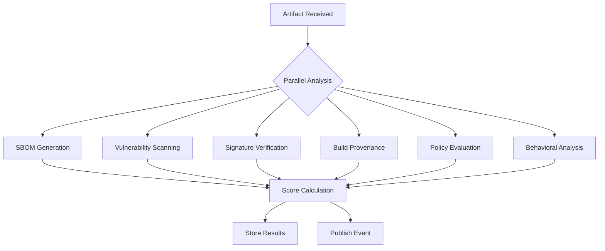

# Kyros Trust Score Engine

## Overview
The Kyros Trust Score Engine is a core innovation that provides a comprehensive, dynamic scoring system for evaluating the security, quality, and reliability of container images and other artifacts stored in the registry. Unlike simple vulnerability scanners that only check for known CVEs, the Trust Score Engine evaluates multiple dimensions of artifact trustworthiness to produce a single, actionable score that helps organizations make informed decisions about what to deploy in production.

## Core Concepts

### What is Trust Score?
Trust Score is a normalized value between 0.0 and 1.0 that represents the overall trustworthiness of an artifact based on multiple weighted factors:
- **Security Vulnerabilities**: Known CVEs and their severity
- **Software Composition**: Bill of Materials quality and licensing
- **Code Signing**: Cryptographic verification of origin and integrity
- **Build Provenance**: Verifiable build process and source correspondence
- **Behavioral Analysis**: Runtime behavior and known good patterns
- **Policy Compliance**: Adherence to organizational security policies
- **Maintenance Status**: Update frequency and end-of-life status
- **Community Signals**: Popularity, maintenance activity, and community trust

### Score Interpretation
- **0.9 - 1.0**: Trusted - Meets all security and quality standards
- **0.7 - 0.89**: High - Minor issues that don't significantly impact security
- **0.5 - 0.69**: Medium - Notable issues requiring review before production use
- **0.3 - 0.49**: Low - Significant concerns; should not be used in production without mitigation
- **0.0 - 0.29**: Untrusted - Critical issues; blocked from production use
- **Unscored**: No score available (newly pushed, scanning in progress, etc.)

## Architecture

### Trust Score Service
The Trust Score Engine is implemented as a dedicated microservice that:
1. Consumes artifact events from the registry via NATS JetStream
2. Performs multi-dimensional analysis on artifacts
3. Calculates weighted trust scores based on configurable policies
4. Stores results in PostgreSQL for retrieval via API
5. Publishes trust score updates to NATS for webhooks and UI updates

### Data Flow
```mermaid
flowchart TD
    A[Registry Service] -->|artifact.pushed| B[NATS JetStream]
    B --> C[Trust Score Service]
    C --> D[SBOM Generator<br/>(Syft)]
    C --> E[Vulnerability Scanner<br/>(Trivy/Grype)]
    C --> F[Signature Verifier<br/>(Cosign)]
    C --> G[Build Metadata Analyzer]
    C --> H[Policy Engine<br/>(OPA)]
    C --> I[Behavioral Analyzer]
    C --> J[Trust Score Calculator]
    J --> K[PostgreSQL<br/>Trust Score Storage]
    J --> L[NATS JetStream<br/>trust.score.updated]
    L --> M[Webhook Service]
    L --> N[API Service]
    L --> O[UI Updates]
```

### Component Responsibilities

#### 1. Event Consumer
- Listens for `artifact.pushed` events from NATS JetStream
- Extracts artifact metadata (digest, repository, tags)
- Initiates analysis pipeline
- Handles duplicate events and out-of-order processing

#### 2. SBOM Generator
- Uses Syft or similar tools to generate Software Bill of Materials
- Supports multiple formats (SPDX, CycloneDX, Syft JSON)
- Captures dependencies, licenses, and component metadata
- Stores SBOM in PostgreSQL for retrieval and analysis

#### 3. Vulnerability Scanner
- Integrates with multiple scanners (Trivy, Grype, Clair, etc.)
- Scans for known vulnerabilities in OS packages and language dependencies
- Maps vulnerabilities to severity levels (Critical, High, Medium, Low, Unknown)
- Tracks fix availability and patch status
- Stores vulnerability findings in PostgreSQL

#### 4. Signature Verifier
- Verifies cryptographic signatures using Cosign, Notary v2, or PGP
- Validates key chains and trust policies
- Checks for timestamp validity and revocation status
- Supports keyless signatures via Fulcio and Rekor
- Records verification status and details

#### 5. Build Metadata Analyzer
- Analyzes build provenance information (if available)
- Verifies build process integrity and reproducibility
- Checks for signed build attestations (SLSA, in-toto)
- Validates source code correspondence
- Assesses build environment security

#### 6. Policy Engine
- Uses Open Policy Agent (OPA) for customizable policy evaluation
- Evaluates organizational security and compliance requirements
- Supports Rego policies for complex rule definitions
- Provides allow/deny/warn decisions based on analysis results
- Integrates with trust score calculation as a weighted factor

#### 7. Behavioral Analyzer
- Analyzes runtime behavior patterns (when available)
- Compares against known good baselines
- Detects anomalous or suspicious behaviors
- Uses machine learning models for anomaly detection (future enhancement)
- Considers execution privileges, network calls, file system access

#### 8. Trust Score Calculator
- Combines all analysis results using weighted formula
- Applies policy decisions as modifiers
- Normalizes scores to 0.0-1.0 range
- Applies temporal decay for aging factors
- Generates detailed breakdown of score components
- Determines trust level category (Trusted, High, Medium, Low, Untrusted)

#### 9. Storage Component
- Persists trust scores, SBOMs, vulnerabilities, and signatures
- Maintains historical scores for trending and audit
- Provides efficient querying by artifact, repository, namespace
- Implements retention policies for historical data
- Supports batch operations for performance

#### 10. Event Publisher
- Publishes `trust.score.updated` events to NATS JetStream
- Includes score, level, and detailed component breakdown
- Enables real-time updates to UI, webhooks, and downstream systems
- Supports event filtering and selective subscription

## Scoring Algorithm

### Factor Categories and Weights
The trust score is calculated as a weighted average of multiple factor categories:

| Factor Category | Weight | Description |
|-----------------|--------|-------------|
| Vulnerability Score | 30% | Based on severity and count of vulnerabilities |
| SBOM Quality | 15% | Completeness and accuracy of software bill of materials |
| Signature Verification | 15% | Cryptographic verification of authenticity and integrity |
| Build Provenance | 10% | Verifiability of build process and source correspondence |
| License Compliance | 10% | Adherence to approved licensing policies |
| Maintenance Status | 10% | Update frequency and end-of-life status |
| Policy Compliance | 10% | Adherence to organizational custom policies |
| Community Signals | 5% | Popularity, maintenance activity, and community trust |

### Detailed Scoring Formulas

#### 1. Vulnerability Score (30% weight)
```python
def calculate_vulnerability_score(vulnerabilities):
    if not vulnerabilities:
        return 1.0  # No vulnerabilities = perfect score
    
    # Weight by severity
    severity_weights = {
        'critical': 10.0,
        'high': 5.0,
        'medium': 2.0,
        'low': 1.0,
        'unknown': 1.5
    }
    
    weighted_sum = sum(severity_weights.get(v.severity.lower(), 1.0) 
                      for v in vulnerabilities)
    
    # Normalize using logarithmic scale to prevent single critical from zeroing score
    # Max expected score for normalization (adjust based on empirical data)
    max_expected_weight = 50.0  # Empirically determined
    
    # Calculate raw penalty (0-1 range where 0 is best, 1 is worst)
    raw_penalty = min(weighted_sum / max_expected_weight, 1.0)
    
    # Convert to score (1.0 - penalty) with floor at 0.0
    return max(1.0 - raw_penalty, 0.0)
```

#### 2. SBOM Quality Score (15% weight)
```python
def calculate_sbom_score(sbom, expected_components=None):
    if not sbom:
        return 0.5  # Neutral score when no SBOM available
    
    score = 0.0
    max_score = 100.0
    
    # Completeness (40 points)
    if sbom.format in ['SPDX', 'CycloneDX']:
        score += 20  # Standard format
    if sbom.components:
        completeness = min(len(sbom.components) / max(len(expected_components or []), 1), 1.0)
        score += 20 * completeness
    
    # Accuracy (30 points)
    # Would involve checking for false positives/negatives in component detection
    # Simplified implementation:
    score += 15  # Assume baseline accuracy
    if sbom.validation_passed:
        score += 15  # Bonus for validated SBOM
    
    # Freshness (20 points)
    age_days = (current_time - sbom.generated_at).days
    freshness_score = max(0, 1 - (age_days / 30))  # 30-day freshness window
    score += 20 * freshness_score
    
    # License Information (10 points)
    if sbom.licenses:
        score += 10  # Has license information
    
    return min(score / max_score, 1.0)
```

#### 3. Signature Verification Score (15% weight)
```python
def calculate_signature_score(signatures, required_signers=None):
    if not signatures:
        return 0.0  # No signatures = zero trust for signature component
    
    verified_count = 0
    total_signatures = len(signatures)
    
    for sig in signatures:
        if sig.verification_status == 'verified':
            # Additional checks for signer trust
            if required_signers is None or sig.signer in required_signers:
                verified_count += 1
            elif sig.signer_trust_level >= 0.8:  # High trust signer
                verified_count += 0.8
            elif sig.signer_trust_level >= 0.6:  # Medium trust signer
                verified_count += 0.6
            else:
                verified_count += 0.3  # Low trust but still verified
        # Failed signatures contribute 0
    
    return verified_count / total_signatures if total_signatures > 0 else 0.0
```

#### 4. Build Provenance Score (10% weight)
```python
def calculate_provenance_score(build_attestation, slsa_level=None):
    if not build_attestation:
        return 0.0  # No provenance = zero trust
    
    score = 0.0
    
    # Basic attestation presence
    if build_attestation.exists:
        score += 0.3
    
    # Signature validation
    if build_attestation.signature_valid:
        score += 0.3
    
    # SLSA level (if specified)
    if slsa_level:
        slsa_scores = {
            'SLSA1': 0.1,
            'SLSA2': 0.2,
            'SLSA3': 0.3,
            'SLSA4': 0.4
        }
        score += slsa_scores.get(slsa_level, 0.0)
    
    # Source completeness
    if build_attestation.source_complete:
        score += 0.1
    
    return min(score, 1.0)
```

#### 5. License Compliance Score (10% weight)
```python
def calculate_license_score(sbom, approved_licenses, restricted_licenses):
    if not sbom or not sbom.components:
        return 0.5  # Neutral when no component data
    
    total_components = len(sbom.components)
    if total_components == 0:
        return 1.0  # No components = no license issues
    
    compliant_count = 0
    problematic_count = 0
    
    for component in sbom.components:
        license_expr = component.license.lower()
        
        # Check against approved licenses
        is_approved = any(approved.lower() in license_expr 
                         for approved in approved_licenses)
        
        # Check against restricted licenses
        is_restricted = any(restricted.lower() in license_expr 
                           for restricted in restricted_licenses)
        
        if is_approved and not is_restricted:
            compliant_count += 1
        elif is_restricted:
            problematic_count += 1
        # Unknown/unclear licenses treated as neutral for now
    
    compliance_ratio = compliant_count / total_components if total_components > 0 else 1.0
    penalty_ratio = problematic_count / total_components if total_components > 0 else 0.0
    
    # Score: compliance ratio minus penalty, bounded between 0 and 1
    return max(0.0, min(1.0, compliance_ratio - (penalty_ratio * 0.5)))
```

#### 6. Maintenance Status Score (10% weight)
```python
def calculate_maintenance_score(last_update_date, eol_date=None, release_frequency=None):
    score = 0.0
    
    # Recency (50% weight)
    days_since_update = (current_time - last_update_date).days
    recency_score = max(0, 1 - (days_since_update / 365))  # Full score if updated within year
    score += 0.5 * recency_score
    
    # End-of-Life status (30% weight)
    if eol_date:
        if current_time < eol_date:
            days_to_eol = (eol_date - current_time).days
            eol_score = min(1.0, days_to_eol / 365)  # Full score if >1 year to EOL
        else:
            eol_score = 0.0  # Already EOL
    else:
        eol_score = 0.5  # Unknown EOL date
    score += 0.3 * eol_score
    
    # Release frequency (20% weight)
    if release_frequency:
        # More frequent releases = better maintenance
        # Assuming releases per year as metric
        freq_score = min(1.0, release_frequency / 12)  # Cap at monthly releases
    else:
        freq_score = 0.5  # Unknown frequency
    score += 0.2 * freq_score
    
    return min(score, 1.0)
```

#### 7. Policy Compliance Score (10% weight)
```python
def calculate_policy_score(opa_decision):
    if not opa_decision:
        return 0.5  # Neutral when no policy evaluation
    
    # OPA typically returns allow/deny or more complex decisions
    decision = opa_decision.get('decision', '').lower()
    
    if decision == 'allow':
        return 1.0
    elif decision == 'warn':
        return 0.7  # Warning but still acceptable
    elif decision == 'conditional':
        return 0.5  # Conditional approval
    elif decision == 'deny':
        return 0.0  # Explicitly denied
    else:
        return 0.5  # Unknown decision
```

#### 8. Community Signals Score (5% weight)
```python
def calculate_community_score(pull_count, star_count, contributor_count, issue_response_time):
    score = 0.0
    
    # Popularity (40% weight) - based on pull/download count
    # Logarithmic scaling to prevent mega-popular items from dominating
    popularity_score = min(1.0, np.log1p(pull_count) / np.log1p(100000))  # Scale to 100k pulls
    score += 0.4 * popularity_score
    
    # Engagement (30% weight) - stars and contributors
    engagement_score = 0.0
    if star_count > 0:
        engagement_score += 0.15 * min(1.0, np.log1p(star_count) / np.log1p(10000))  # Scale to 10k stars
    if contributor_count > 0:
        engagement_score += 0.15 * min(1.0, np.log1p(contributor_count) / np.log1p(1000))  # Scale to 1k contributors
    score += 0.3 * min(1.0, engagement_score)
    
    # Responsiveness (30% weight) - how quickly issues are addressed
    # Assuming issue_response_time in hours
    responsiveness_score = max(0, 1 - (issue_response_time / 168))  # 1 week = 168 hours
    score += 0.3 * responsiveness_score
    
    return min(score, 1.0)
```

### Final Score Calculation
```python
def calculate_trust_score(factors):
    """
    Calculate final trust score from factor components.
    
    Args:
        factors: dict with keys matching factor categories and values 0.0-1.0
        
    Returns:
        tuple: (final_score, level, breakdown)
    """
    weights = {
        'vulnerability': 0.30,
        'sbom': 0.15,
        'signature': 0.15,
        'provenance': 0.10,
        'license': 0.10,
        'maintenance': 0.10,
        'policy': 0.10,
        'community': 0.05
    }
    
    # Calculate weighted sum
    weighted_sum = sum(factors.get(key, 0.5) * weight 
                      for key, weight in weights.items())
    
    # Apply temporal decay (optional)
    # newer artifacts get slight boost, older ones slight decay
    # implementation depends on specific requirements
    
    # Ensure score is in valid range
    final_score = max(0.0, min(1.0, weighted_sum))
    
    # Determine level
    if final_score >= 0.9:
        level = "trusted"
    elif final_score >= 0.7:
        level = "high"
    elif final_score >= 0.5:
        level = "medium"
    elif final_score >= 0.3:
        level = "low"
    else:
        level = "untrusted"
    
    # Create breakdown for transparency
    breakdown = {
        'final_score': round(final_score, 3),
        'level': level,
        'factors': {k: round(v, 3) for k, v in factors.items()},
        'weights': weights,
        'weighted_contributions': {
            k: round(v * weights.get(k, 0), 3) 
            for k, v in factors.items()
        },
        'timestamp': datetime.utcnow().isoformat() + 'Z'
    }
    
    return final_score, level, breakdown
```

## Policy Engine Integration

### OPA Policy Structure
Trust Score policies are written in Rego and evaluated by the Open Policy Agent:

```rego
package kyros.trustscore

# Default allow rule - can be overridden by specific policies
default allow = false

# Allow if trust score meets minimum threshold
allow {
    input.trust_score >= 0.7
    input.level in ["high", "trusted"]
}

# Deny if critical vulnerabilities present
deny {
    input.vulnerabilities[_].severity == "critical"
    reason := "Critical vulnerability detected"
}

# Warn if license issues
warn {
    input.license_compliance < 0.8
    reason := sprintf("License compliance below threshold: %0.2f", [input.license_compliance])
}

# Require signatures for production images
deny {
    input.repository.namespace == "production"
    input.signature_count == 0
    reason := "Production images must be signed"
}

# Check for EOL components
deny {
    input.sbom.components[_].name == "openssl"
    input.sbom.components[_].version < "1.1.1"
    reason := "EOL OpenSSL version detected"
}

# Custom policy for specific registries
package kyros.trustscore.registries.prod

allow {
    input.trust_score >= 0.85
    not deny_other
}

deny_other {
    # Additional production-specific restrictions
    input.vulnerabilities[_].severity == "high"
    count([v | v := input.vulnerabilities[_]; v.severity == "high"]) > 5
    reason := "Too many high severity vulnerabilities for production"
}
```

### Policy Evaluation Points
Policies are evaluated at multiple stages in the pipeline:

1. **Pre-Analysis**: Basic validation policies (artifact exists, required metadata present)
2. **During Analysis**: Intermediate policies that can short-circuit expensive analysis
3. **Post-Analysis**: Final trust score and recommendation policies
4. **Pre-Storage**: Policies that determine whether to store results
5. **Pre-Publication**: Policies that determine whether to publish score updates

### Policy Decision Types
- **allow**: Proceed with normal processing
- **deny**: Block processing/storage/publication with reason
- **warn**: Proceed but record warning in audit trail
- **conditional**: Proceed with specific conditions or modifications
- **defer**: Delay decision pending additional information

## Integration Points

### Registry Service Integration
The Trust Score Engine integrates with the Kyros Registry Service at multiple points:

#### 1. Pre-Hook (Optional)
Before storing an artifact, the registry can optionally:
- Request a trust score assessment
- Block storage if score falls below threshold
- Tag artifact with preliminary assessment

#### 2. Post-Hook (Standard)
After storing an artifact, the registry:
- Publishes `artifact.pushed` event to NATS
- Optionally waits for trust score calculation (synchronous mode)
- Stores trust score in registry metadata for fast retrieval

#### 3. API Extension
The registry API exposes trust score endpoints:
```http
GET /v2/<name>/manifests/<reference>/trustscore
# Returns trust score and metadata for specific manifest

GET /v2/<name>/tags/list?include_trustscores=true
# Returns tag list with trust score annotations
```

### Webhook Integration
Trust score updates trigger webhook events:
```json
{
  "type": "trust.score.updated",
  "action": "updated",
  "target": {
    "mediaType": "application/vnd.kyros.trustscore.v1+json",
    "digest": "sha256:abc123...",
    "length": 1234,
    "url": "https://registry.kyros.example.com/v2/my-repo/manifests/@e692418e-3f09-4274-b814-4610a8b6a8a1"
  },
  "request": {
    "id": "c5d9f290-91b9-11ea-bc55-0242ac130003",
    "host": "registry.kyros.example.com",
    "method": "POST",
    "url": "/v2/my-repo/manifests/my-tag"
  },
  "actor": {
    "name": "admin-user"
  },
  "source": {
    "addr": "10.0.0.1:5000",
    "instanceID": "trustscore-7b9c5f4d6d6d6d-kslx2"
  },
  "timestamp": "2023-07-19T15:04:05.123456Z",
  "metadata": {
    "trustScore": 0.82,
    "level": "high",
    "repository": "my-repo",
    "tag": "v1.2.3",
    "digest": "sha256:e692418e-3f09-4274-b814-4610a8b6a8a1",
    "factors": {
      "vulnerability": 0.75,
      "sbom": 0.90,
      "signature": 0.60,
      "provenance": 0.80,
      "license": 0.85,
      "maintenance": 0.70,
      "policy": 0.95,
      "community": 0.60
    }
  }
}
```

### API Service Integration
The API Service provides endpoints for trust score management:
- **Retrieval**: Get trust scores for artifacts, repositories, namespaces
- **Filtering**: Filter by score range, level, time period
- **Aggregation**: Get average scores, distribution statistics
- **History**: View score changes over time
- **Policies**: Manage trust score policies and rules
- **Overrides**: Manual override capabilities for exceptional cases

### UI Integration
The web interface displays trust scores prominently:
- **Badge System**: Color-coded badges next to images/tags
- **Detail Views**: Detailed breakdown of score components
- **Trending**: Historical score trends and charts
- **Filtering**: Hide/show images by trust score thresholds
- **Recommendations**: Actionable advice based on score factors
- **Bulk Operations**: Apply actions to multiple images based on scores

## Storage Schema

### Trust Scores Table
```sql
CREATE TABLE trust_scores (
    id UUID PRIMARY KEY DEFAULT gen_random_uuid(),
    artifact_id UUID NOT NULL UNIQUE REFERENCES artifacts(id) ON DELETE CASCADE,
    score FLOAT NOT NULL CHECK (score >= 0.0 AND score <= 1.0),
    level VARCHAR(20) NOT NULL, -- trusted, high, medium, low, untrusted
    factors JSONB, -- Detailed breakdown of scoring factors
    policy_id UUID NULL REFERENCES policies(id) ON DELETE SET NULL,
    calculated_at TIMESTAMP WITH TIME ZONE DEFAULT NOW(),
    expires_at TIMESTAMP WITH TIME ZONE, -- For time-sensitive scores
    version INTEGER DEFAULT 1, -- For handling updates/recalculations
    calculated_by UUID NULL REFERENCES users(id) ON DELETE SET NULL, -- For manual overrides
    CONSTRAINT valid_level CHECK (level IN ('trusted', 'high', 'medium', 'low', 'untrusted'))
);

-- Indexes for performance
CREATE INDEX idx_trust_scores_artifact_id ON trust_scores(artifact_id);
CREATE INDEX idx_trust_scores_score ON trust_scores(score);
CREATE INDEX idx_trust_scores_level ON trust_scores(level);
CREATE INDEX idx_trust_scores_calculated_at ON trust_scores(calculated_at);
CREATE INDEX idx_trust_scores_expires_at ON trust_scores(expires_at) WHERE expires_at IS NOT NULL;
```

### Factors JSONB Structure
The `factors` column contains a JSONB object with detailed breakdown:
```json
{
  "vulnerability": {
    "score": 0.75,
    "details": {
      "critical": 0,
      "high": 2,
      "medium": 5,
      "low": 12,
      "unknown": 0,
      "weighted_sum": 24.0,
      "max_expected": 32.0
    }
  },
  "sbom": {
    "score": 0.90,
    "details": {
      "format": "CycloneDX",
      "component_count": 147,
      "license_coverage": 0.95,
      "age_days": 2
    }
  },
  "signature": {
    "score": 0.60,
    "details": {
      "signature_count": 2,
      "verified_count": 1,
      "signers": ["cosign-key-1", "unknown-key-2"],
      "verification_status": ["verified", "unverified"]
    }
  },
  "provenance": {
    "score": 0.80,
    "details": {
      "build_attestation_present": true,
      "signature_valid": true,
      "slsa_level": "SLSA2",
      "source_complete": true
    }
  },
  "license": {
    "score": 0.85,
    "details": {
      "approved_licenses": ["MIT", "Apache-2.0", "GPL-3.0"],
      "restricted_licenses": ["GPL-1.0", "AGPL-3.0"],
      "compliant_components": 132,
      "restricted_components": 3,
      "unknown_license_components": 12
    }
  },
  "maintenance": {
    "score": 0.70,
    "details": {
      "days_since_update": 45,
      "eol_date": null,
      "release_frequency": 8.5  // releases per year
    }
  },
  "policy": {
    "score": 0.95,
    "details": {
      "policies_evaluated": ["baseline-security", "company-standards"],
      "all_passed": true,
      "warnings": [],
      "denials": []
    }
  },
  "community": {
    "score": 0.60,
    "details": {
      "pull_count": 12450,
      "star_count": 842,
      "contributor_count": 23,
      "avg_issue_response_hours": 24.5
    }
  }
}
```

## Configuration and Customization

### Environment Variables
```env
# Service Configuration
TRUST_SERVICE_ENABLED=true
TRUST_SERVICE_LISTEN_ADDR=:8080
TRUST_SERVICE_LOG_LEVEL=info

# Scanning Configuration
TRUST_SBOM_TOOL=syft  # syft, spdx-tools, cyclonedx-bom
TRUST_VULN_SCANNERS=trivy,grype  # Comma-separated list
TRUST_SIGNATURE_TOOL=cosign  # cosign, notary, pgp
TRUST_BUILD_TOOL=slack  # slsa-verifier, in-toto-verifier

# Scoring Weights (can be overridden per policy)
TRUST_WEIGHT_VULNERABILITY=0.30
TRUST_WEIGHT_SBOM=0.15
TRUST_WEIGHT_SIGNATURE=0.15
TRUST_WEIGHT_PROVENANCE=0.10
TRUST_WEIGHT_LICENSE=0.10
TRUST_WEIGHT_MAINTENANCE=0.10
TRUST_WEIGHT_POLICY=0.10
TRUST_WEIGHT_COMMUNITY=0.05

# Thresholds
TRUST_AUTO_BLOCK_THRESHOLD=0.3  # Auto-block below this score
TRUST_MANUAL_REVIEW_THRESHOLD=0.5  # Flag for manual review below this
TRUST_AUTO_APPROVE_THRESHOLD=0.8  # Auto-approve above this (with other checks)

# Caching
TRUST_CACHE_TTL=300  # 5 minutes for scoring cache
TRUST_SBOM_CACHE_TTL=3600  # 1 hour for SBOM cache
TRUST_VULN_CACHE_TTL=1800  # 30 minutes for vulnerability cache

# Retention
TRUST_SCORE_RETENTION_DAYS=365  # Keep scores for 1 year
TRUST_HISTORY_RETENTION_DAYS=730  # Keep history for 2 years
```

### Policy Configuration
Policies can be configured via:
1. **Database Policies**: Stored in `policies` table with Rego rules
2. **File System Policies**: Loaded from directory on startup
3. **Remote Policies**: Fetched from URL (Consul, etcd, S3, etc.)
4. **API Managed**: Created/updated via Trust Score API

### Scoring Profiles
Different scoring profiles can be defined for different use cases:
- **Production**: Strict security requirements, high vulnerability weight
- **Development**: More lenient, faster feedback cycle
- **Compliance**: Focus on regulatory requirements (HIPAA, PCI-DSS, etc.)
- **Performance**: Optimized for speed, fewer checks
- **Air-Gapped**: No external dependencies, local-only scanning

## Extensibility

### Adding New Analysis Modules
New analysis components can be added by:
1. Implementing the `Analyzer` interface
2. Registering with the analysis pipeline
3. Defining scoring contribution and weight
4. Adding to configuration and documentation

#### Analyzer Interface
```go
type Analyzer interface {
    // Name returns the analyzer name
    Name() string
    
    // Analyze performs analysis on the artifact
    // Returns result data and error if analysis failed
    Analyze(ctx context.Context, artifact *Artifact) (interface{}, error)
    
    // Score converts analysis result to a score (0.0-1.0)
    Score(result interface{}) (float64, error)
    
    // Weight returns the weight factor for this analyzer (0.0-1.0)
    Weight() float64
    
    // Description returns human-readable description
    Description() string
    
    // IsRequired returns whether this analyzer is required for scoring
    IsRequired() bool
}
```

### Custom Scoring Functions
Organizations can customize scoring by:
1. **Adjusting Weights**: Changing the importance of different factors
2. **Custom Functions**: Replacing scoring formulas with domain-specific logic
3. **Threshold Modification**: Changing what scores mean for different contexts
4. **Factor Addition/Removal**: Adding domain-specific factors or removing irrelevant ones

### Integration with External Systems
The Trust Score Engine can integrate with:
- **SIEM Systems**: Sending alerts for low-trust artifacts
- **Ticketing Systems**: Automatically creating tickets for policy violations
- **CI/CD Systems**: Blocking deployments based on trust scores
- **Service Meshes**: Enforcing trust-based traffic policies
- **GitOps Tools**: Automating promotion based on trust score thresholds

## Performance Considerations

### Analysis Parallelization
Analysis steps can run in parallel where independent:


### Caching Strategy
- **SBOM Cache**: Cache generated SBOMs by artifact digest
- **Vulnerability Cache**: Cache scan results by SBOM hash
- **Signature Cache**: Cache verification results by signature
- **Policy Cache**: Cache OPA decisions by input hash
- **Score Cache**: Cache final scores by artifact + configuration hash

### Resource Management
- **Worker Pools**: Configurable worker pools for each analysis type
- **Queue Depth**: Bounded queues to prevent memory exhaustion
- **Rate Limiting**: Per-analysis rate limiting to prevent resource exhaustion
- **Timeouts**: Configurable timeouts for each analysis step
- **Bulk Processing**: Batch similar artifacts for efficiency

### Scaling Characteristics
- **CPU Bound**: Vulnerability scanning and SBOM generation
- **I/O Bound**: Reading artifact layers, writing to storage
- **Memory Bound**: Holding intermediate analysis results
- **Network Bound**: External service calls (if using cloud scanners)

## Security Considerations

### Analysis Environment Isolation
- **Sandboxing**: Analysis runs in isolated containers or VMs
- **Resource Limits**: CPU, memory, disk, and network limits per analysis
- **Filesystem Isolation**: Read-only root filesystem with temporary writable layers
- **Network Restrictions**: Limited outbound connectivity (allow-list for update servers)
- **Privilege Reduction**: Runs as non-root user with minimal capabilities

### Data Protection
- **Input Validation**: All artifact data validated before processing
- **Output Encoding**: Proper encoding of results to prevent injection
- **Secrets Management**: Secure handling of keys, tokens, and credentials
- **Audit Logging**: All access to sensitive data logged
- **Memory Sanitization**: Sensitive data wiped from memory after use

### Supply Chain Security for Analyzers
- **Signed Analyzers**: Analysis tools themselves are signed and verified
- **Immutable Images**: Analysis containers use immutable, signed images
- **Version Pinning**: Exact versions of analysis tools specified and locked
- **Vulnerability Scanning**: Analysis tools themselves scanned for vulnerabilities
- **Build Provenance**: Analysis tools built with verifiable provenance

## Error Handling and Resilience

### Partial Failure Handling
The system gracefully handles partial failures:
- **Optional Analyzers**: Some analyzers can fail without stopping scoring
- **Degraded Mode**: Reduced functionality when non-critical components fail
- **Circuit Breakers**: Prevent cascading failures to external services
- **Retry Logic**: Transient failures retried with exponential backoff
- **Fallback Values**: Default scores used when analysis unavailable

### Error Classification
- **Transient Errors**: Network timeouts, temporary service unavailability
- **Permanent Errors**: Invalid input, configuration errors, unsupported artifacts
- **Configuration Errors**: Missing or invalid configuration
- **Resource Exhaustion**: Out of memory, disk space, or rate limits

### Recovery Mechanisms
- **Checkpointing**: Long-running analyses can checkpoint progress
- **Idempotency**: Safe to retry operations without side effects
- **Dead Letter Queues**: Failed events sent to DLQ for later inspection
- **Manual Intervention**: Alerts for situations requiring human judgment
- **Automatic Rollback**: Ability to revert scoring changes if needed

## Monitoring and Observability

### Metrics
The Trust Score Service exports Prometheus metrics:
```prometheus
# Analysis metrics
trustscore_analysis_duration_seconds{analyzer="sbom"} 1.23
trustscore_analysis_duration_seconds{analyzer="vulnerability"} 4.56
trustscore_analysis_total{analyzer="sbom",result="success"} 1245
trustscore_analysis_total{analyzer="vulnerability",result="error"} 12

# Scoring metrics
trustscore_score_distribution{le="0.1"} 5
trustscore_score_distribution{le="0.2"} 12
trustscore_score_distribution{le="0.3"} 23
trustscore_score_distribution{le="0.4"} 45
trustscore_score_distribution{le="0.5"} 67
trustscore_score_distribution{le="0.6"} 89
trustscore_score_distribution{le="0.7"} 120
trustscore_score_distribution{le="0.8"} 150
trustscore_score_distribution{le="0.9"} 180
trustscore_score_distribution{le="1.0"} 200

# Business metrics
trustscore_artifacts_processed_total 2000
trustscore_artifacts_blocked_total 45
trustscore_average_score 0.68

# Resource metrics
trustscore_active_analyzers 4
trustscore_queue_length 12
trustscore_worker_utilization 0.75
```

### Logging
Structured logging with trace IDs for end-to-end tracing:
```json
{
  "timestamp": "2023-07-19T15:04:05.123Z",
  "level": "info",
  "message": "Analysis completed",
  "service": "trustscore",
  "traceID": "a1b2c3d4-e5f6-7890-g1h2-i3j4k5l6m7n8",
  "spanID": "b2c3d4e5-f6g7-8901-h2i3-j4k5l6m7n8o9",
  "artifactID": "c3d4e5f6-g7h8-9012-i3j4-k5l6m7n8o9p0",
  "repository": "my-app",
  "tag": "v1.2.3",
  "digest": "sha256:e692418e3f094274b8144610a8b6a8a1",
  "analysis": {
    "sbom": {"status": "success", "duration_ms": 1200},
    "vulnerability": {"status": "success", "duration_ms": 3500},
    "signature": {"status": "success", "duration_ms": 800},
    "provenance": {"status": "skipped", "reason": "not_available"},
    "policy": {"status": "success", "duration_ms": 150}
  },
  "result": {
    "score": 0.72,
    "level": "medium",
    "timestamp": "2023-07-19T15:04:05.123Z"
  }
}
```

### Health Checks
- **Liveness**: Basic service responsiveness
- **Readiness**: Ability to accept and process work
- **Startup**: Initialization completion
- **Dependencies**: Connectivity to required services (NATS, PostgreSQL, Redis)
- **Resources**: Memory, disk space, file descriptor usage
- **Processing Lag**: Time between event receipt and processing completion

## Operational Considerations

### Deployment Guidelines
- **Resource Allocation**: 
  - CPU: 2-4 cores per instance (scalable based on volume)
  - Memory: 4-8 GB RAM per instance
  - Storage: Minimal local storage (mostly uses external services)
- **Instance Count**: 
  - Low volume (<100 artifacts/hour): 1-2 instances
  - Medium volume (100-1000 artifacts/hour): 3-5 instances
  - High volume (>1000 artifacts/hour): 5+ instances with load balancing
- **Storage Backend**: 
  - PostgreSQL: Primary storage for scores and metadata
  - Redis: Caching layer for performance
  - Object Storage: For large artifacts if needed (typically handled by registry)

### Maintenance Procedures
- **Regular Scanning**: Schedule periodic rescanning of existing artifacts
- **Database Maintenance**: 
  - Vacuum and analyze PostgreSQL tables regularly
  - Archive old scores per retention policy
  - Rebuild indexes as needed
- **Cache Management**: 
  - Monitor cache hit ratios
  - Clear stale caches when configuration changes
  - Adjust TTL values based on observation
- **Scanner Updates**: 
  - Keep scanning tools updated with latest vulnerability definitions
  - Test new scanner versions in staging before production
  - Monitor scanner performance and accuracy

### Backup and Recovery
- **Database Backups**: Regular logical and physical backups of PostgreSQL
- **Configuration Backup**: Version control for policy files and configuration
- **Recovery Procedures**: 
  - Point-in-time recovery for database
  - Rebuild caches from scratch if needed
  - Reprocess artifacts from queue if processing lost
- **Disaster Recovery**: 
  - Multi-region deployment for catastrophic failures
  - Cross-region replication of critical data
  - Automated failover procedures

### Upgrade Strategy
- **Rolling Updates**: Update instances one at a time to maintain availability
- **Database Migrations**: Backward-compatible schema changes
- **Configuration Changes**: Validate before rolling out
- **Scanner Updates**: Test new versions in isolated environment
- **Rollback Procedures**: Ability to revert to previous version if needed

## Usage Examples

### Checking Trust Score via API
```bash
# Get trust score for specific artifact
curl -H "Authorization: Bearer $TOKEN" \
  https://kyros.example.com/api/v1/trust/scores/sha256:e3b0c44298fc1c149afbf4c8996fb92427ae41e4649b934ca495991b7852b855

# Response
{
  "id": "a1b2c3d4-e5f6-7890-g1h2-i3j4k5l6m7n8",
  "artifact_id": "b2c3d4e5-f6g7-8901-h2i3-j4k5l6m7n8o9",
  "score": 0.82,
  "level": "high",
  "factors": {
    "vulnerability": {"score": 0.75, "details": {...}},
    "sbom": {"score": 0.90, "details": {...}},
    "signature": {"score": 0.60, "details": {...}},
    "provenance": {"score": 0.80, "details": {...}},
    "license": {"score": 0.85, "details": {...}},
    "maintenance": {"score": 0.70, "details": {...}},
    "policy": {"score": 0.95, "details": {...}},
    "community": {"score": 0.60, "details": {...}}
  },
  "calculated_at": "2023-07-19T15:04:05.123Z",
  "version": 1
}
```

### Setting Trust Score Policies via API
```bash
# Create a new trust policy
curl -X POST https://kyros.example.com/api/v1/trust/policies \
  -H "Authorization: Bearer $TOKEN" \
  -H "Content-Type: application/json" \
  -d '{
    "name": "production-security",
    "description": "Strict security policy for production images",
    "rules": {
      "deny": [
        "vulnerability.critical > 0",
        "vulnerability.high > 5",
        "signature.verified_count == 0",
        "license.compliance < 0.8"
      ],
      "warn": [
        "vulnerability.medium > 10",
        "score < 0.7"
      ]
    },
    "scope": "global",
    "enabled": true
  }'

# Evaluate policy against artifact
curl -X POST https://kyros.example.com/api/v1/trust/policies/123e4567-e89b-12d3-a456-426614174000/evaluate \
  -H "Authorization: Bearer $TOKEN" \
  -H "Content-Type: application/json" \
  -d '{
    "artifact_id": "b2c3d4e5-f6g7-8901-h2i3-j4k5l6m7n8o9"
  }'
```

### Using Trust Scores in CI/CD Pipeline
```yaml
# Example GitHub Actions workflow
name: Deploy to Production

on:
  push:
    branches: [ main ]

jobs:
  deploy:
    runs-on: ubuntu-latest
    steps:
    - name: Checkout code
      uses: actions/checkout@v2
    
    - name: Build and push image
      uses: docker/build-push-action@v2
      with:
        context: .
        push: true
        tags: kyros.example.com/my-app:${{ github.sha }}
    
    - name: Check trust score
      id: trust-check
      uses: http-request-action@v1
      with:
        url: https://kyros.example.com/api/v1/trust/scores
        method: POST
        headers: |
          Authorization: Bearer ${{ secrets.KYROS_TOKEN }}
          Content-Type: application/json
        data: |
          {
            "artifact_digest": "sha256:${{ steps.build.outputs.digest }}"
          }
    
    - name: Evaluate trust score
      run: |
        SCORE=$(echo '${{ steps.trust-check.outputs.response.body }}' | jq '.score')
        if (( $(echo "$SCORE < 0.7" | bc -l) )); then
          echo "Trust score too low for production deployment: $SCORE"
          exit 1
        fi
        echo "Trust score acceptable: $SCORE"
    
    - name: Deploy to production
      if: steps.trust-check.outcome == 'success'
      uses: ./deploy-to-production
```

## Future Enhancements

### Near-Term Improvements (0-6 months)
1. **Enhanced SBOM Formats**: Support for SPDX 2.3, CycloneDX 1.4, and emerging standards
2. **Additional Scanners**: Integration with Syft Grype, Aqua Trivy, and commercial scanners
3. **Policy Templates**: Pre-built policies for common compliance frameworks (CIS, NIST, etc.)
4. **Performance Optimization**: Improved caching and parallel processing
5. **UI Enhancements**: Better visualization of score components and trends
6. **API Expansion**: Bulk operations, historical analysis, and export capabilities

### Mid-Term Features (6-18 months)
1. **Machine Learning Integration**: 
   - Anomaly detection for zero-day threat prediction
   - Automated policy recommendation based on organizational patterns
   - Dynamic weight adjustment based on historical effectiveness
2. **Supply Chain Intelligence**:
   - Dependency risk scoring (beyond direct vulnerabilities)
   - Supply chain attack surface analysis
   - Transitive dependency tracking and scoring
3. **Dynamic Scoring**:
   - Time-decay factors for aging vulnerabilities
   - Context-aware scoring (different scores for different deployment contexts)
   - Real-time threat intelligence feeds integration
4. **Policy-as-Code Evolution**:
   - Visual policy editor for non-technical users
   - Policy testing and simulation framework
   - Policy versioning and change management
5. **Integration Deepening**:
   - Native integration with service meshes (Istio, Linkerd)
   - Kubernetes admission controller integration
   - GitOps ArgoCD/Kargo integration for automated promotion

### Long-Term Vision (18+ months)
1. **Autonomous Trust Management**:
   - Self-healing remediation suggestions
   - Automated vulnerability patching pull requests
   - Intelligent baseline establishment and drift detection
2. **Distributed Trust Networks**:
   - Federated trust scoring across organizations
   - Cross-organizational trust validation
   - Reputation-based systems for public artifacts
3. **Quantum-Resistant Cryptography**:
   - Post-quantum signature verification preparation
   - Quantum-safe key management for signing
4. **Behavioral Analytics**:
   - Runtime behavior profiling and baselining
   - Anomaly detection in production environments
   - Behavioral whitelisting/blacklisting
5. **Predictive Trust Scoring**:
   - Forecasting future trust scores based on change patterns
   - Impact analysis of proposed changes
   - Risk assessment for planned updates

## Compliance and Standards

### Supported Standards
- **SPDX 2.2**: Software Package Data Exchange for SBOMs
- **CycloneDX 1.3**: Lightweight SBOM standard
- **SLSA Framework**: Supply-chain Levels for Software Artifacts
- **in-toto**: Framework for securing software supply chains
- **OCI Distribution**: Container registry protocol
- **OCI Image Format**: Container image specification
- **OCI Referrers**: Discovering related artifacts
- **Cosign**: Container signing, verification, and storage
- **Reactor**: Transparency log for software artifacts
- **Fulcio**: Certificate authority for code signing
- **OPA**: Open Policy Agent for policy decision making
- **Prometheus**: Monitoring and alerting toolkit
- **OpenTelemetry**: Observability framework
- **JSON Schema**: For validating policy inputs and outputs

### Compliance Frameworks Supported
Through configurable policies, the Trust Score Engine can support:
- **NIST CSF**: National Institute of Standards and Technology Cybersecurity Framework
- **ISO 27001**: Information Security Management
- **SOC 2**: Service Organization Control 2
- **HIPAA**: Health Insurance Portability and Accountability Act
- **PCI DSS**: Payment Card Industry Data Security Standard
- **GDPR**: General Data Protection Regulation
- **CCPA**: California Consumer Privacy Act
- **FedRAMP**: Federal Risk and Authorization Management Program
- **CIS Benchmarks**: Center for Internet Security Security Benchmarks
- **MITRE ATT&CK**: Adversarial Tactics, Techniques & Common Knowledge
- **SBOM Standards**: Various Software Bill of Materials formats
- **SLSA Levels**: Supply-chain Levels for Software Artifacts

## Limitations and Trade-offs

### Current Limitations
1. **Analysis Time**: Comprehensive analysis can take 30 seconds to several minutes per artifact
2. **Resource Intensive**: Scanning requires significant CPU and memory resources
3. **Scanner Dependencies**: Quality depends on underlying scanner accuracy and coverage
4. **Policy Complexity**: Advanced policies require Rego expertise
5. **Dynamic Environments**: Challenging to score rapidly changing artifacts (e.g., nightly builds)
6. **Context Blindness**: Same score regardless of deployment context (dev vs prod)
7. **Limited Behavioral Analysis**: Current implementation focuses on static analysis
8. **Signature Verification Challenges**: Key distribution and trust establishment complexity

### Mitigation Strategies
1. **Incremental Scanning**: Cache results and only rescan when artifacts change
2. **Resource Pooling**: Efficient use of computing resources through queuing and worker pools
3. **Scanner Agnosticism**: Ability to use multiple scorers and combine results
4. **Policy Templates**: Provide pre-built policies for common use cases
5. **Streaming Analysis**: Process artifacts as they arrive rather than batching
6. **Context Tags**: Allow tagging artifacts with deployment context for score adjustment
7. **Extensible Framework**: Easy to add new analysis dimensions as needed
8. **Key Management Integration**: Integration with enterprise key management solutions

### Performance Trade-offs
- **Accuracy vs Speed**: More thorough analysis takes longer but provides better accuracy
- **Completeness vs Coverage**: Checking more factors increases confidence but requires more resources
- **Real-time vs Batch**: Real-time scoring provides immediate feedback but may delay pipeline
- **Centralized vs Distributed**: Centralized scoring ensures consistency but creates bottleneck
- **Stored vs Computed**: Storing scores enables fast retrieval but requires storage and invalidation logic

## Best Practices

### Deployment Best Practices
1. **Right-size Resources**: Monitor utilization and adjust resources based on actual load
2. **Enable Caching**: Properly configure TTL values for different cache types
3. **Monitor Queues**: Watch queue depths to detect processing backlogs
4. **Set Alerts**: Configure alerts for processing failures, high latency, or resource exhaustion
5. **Regular Updates**: Keep scanning tools and vulnerability databases up to date
6. **Test Policies**: Validate policies in staging before applying to production
7. **Backup Regularly**: Implement robust backup and recovery procedures
8. **Document Exceptions**: Maintain records of policy exceptions and justifications

### Operational Best Practices
1. **Establish Baselines**: Understand normal score distributions for your environment
2. **Define Clear Policies**: Have well-documented, unambiguous trust score policies
3. **Implement Gradual Rollout**: Start with monitoring mode before enforcing blocks
4. **Educate Users**: Train developers and operators on interpreting and acting on scores
5. **Review Regularly**: Periodically review and update policies based on experience
6. **Integrate Early**: Incorporate trust checks early in the development lifecycle
7. **Automate Responses**: Use webhooks and APIs to automate responses to score changes
8. **Audit Regularly**: Regularly audit the trust scoring system itself for accuracy and fairness

### Policy Best Practices
1. **Start Simple**: Begin with basic policies before adding complex logic
2. **Test Thoroughly**: Use test cases to validate policy behavior
3. **Document Rationale**: Explain why each policy rule exists
4. **Version Control**: Keep policies in version control with change tracking
5. **Separate Concerns**: Keep security, compliance, and operational policies distinct
6. **Enable Auditing**: Ensure policy decisions are logged for review
7. **Provide Escape Hatches**: Allow for emergency overrides with proper controls
8. **Review Regularly**: Schedule periodic policy reviews and updates

### Interpretation Best Practices
1. **Understand Factors**: Know what contributes to each score component
2. **Consider Context**: Apply scores appropriately based on deployment context
3. **Look Beyond the Number**: Examine the detailed breakdown, not just the score
4. **Trend Analysis**: Look at score changes over time, not just absolute values
5. **Combine with Other Signals**: Use trust scores alongside other security signals
6. **Set Appropriate Thresholds**: Different environments may require different thresholds
7. **Act on Trends**: Address declining scores before they reach critical thresholds
8. **Use for Improvement**: Use low scores as opportunities for improvement, not just rejection

## Troubleshooting

### Common Issues and Solutions

#### High Latency in Scoring
**Symptoms**: Trust score calculation taking excessively long (>5 minutes)
**Diagnosis**:
- Check scanner performance and resource utilization
- Review queue depths and worker utilization
- Examine individual analyzer timing in logs
**Solutions**:
- Increase worker pool sizes for bottlenecked analyzers
- Optimize scanner configuration (timeout, concurrency)
- Consider upgrading scanning tools to more efficient versions
- Implement aggressive caching for frequently seen artifacts
- Add more instances to distribute load

#### Low Scores Across Board
**Symptoms**: Most artifacts receiving unexpectedly low trust scores
**Diagnosis**:
- Check if scanners are returning false positives
- Verify policy configuration is not overly restrictive
- Examine recent changes to scanning tools or vulnerability databases
- Validate artifact sources and build processes
**Solutions**:
- Temporarily disable specific scanners to isolate issue
- Adjust policy thresholds based on baseline expectations
- Update scanner configurations or false positive filters
- Contact scanner vendors if issue appears to be tool-related
- Review and improve build processes to reduce false positives

#### Missing Trust Scores
**Symptoms**: Some artifacts showing as "unscored" or missing scores
**Diagnosis**:
- Check event processing logs for missed or failed events
- Verify NATS JetStream connectivity and subscription status
- Look for errors in analysis pipeline preventing score calculation
- Check for resource exhaustion causing timeouts or failures
**Solutions**:
- Ensure event processing is keeping up with ingest rate
- Increase resources for event consumers if lagging
- Fix any failing analysis components
- Implement dead letter queue for failed events with retry mechanism
- Add alerts for processing lag or failure rates

#### Inconsistent Scores
**Symptoms**: Same artifact receiving different scores at different times
**Diagnosis**:
- Check if underlying data (vulnerability databases) has changed
- Verify scanner versions and configurations are consistent
- Examine if artifacts are actually different (different builds, etc.)
- Look for race conditions in scoring calculation
**Solutions**:
- Implement version pinning for scanners and databases
- Ensure deterministic processing order for independent analyses
- Add version tracking to scores to explain changes over time
- Use cryptographic hashing of inputs to detect actual changes
- Consider scoring stability requirements in policy design

### Diagnostic Commands
```bash
# Check service health
curl http://localhost:8080/healthz
curl http://localhost:8080/readyz
curl http://localhost:8080/startedz

# Get metrics
curl http://localhost:8080/metrics

# Check queue depths (if using Redis)
redis-cli LLEN trustscore:queue:sbom
redis-cli LLEN trustscore:queue:vulnerability
redis-cli LLEN trustscore:queue:signature

# Check recent logs
journalctl -u trustscore-service -n 100 --no-pager

# Test individual analyzer
curl -X POST http://localhost:8080/test/analyzer/sbom \
  -H "Content-Type: application/json" \
  -d '{"artifact_digest": "sha256:e3b0c44298fc1c149afbf4c8996fb92427ae41e4649b934ca495991b7852b855"}'
```

## Conclusion

The Kyros Trust Score Engine represents a significant advancement in software supply chain security by providing a comprehensive, measurable approach to assessing artifact trustworthiness. By combining multiple dimensions of security, quality, and operational factors into a single actionable score, organizations can make informed decisions about what to run in production while maintaining visibility into the strengths and weaknesses of their software supply chain.

The extensible architecture allows organizations to tailor the scoring model to their specific risk tolerance, regulatory requirements, and operational needs. As the software supply chain threat landscape continues to evolve, the Trust Score Engine provides a foundation for continuous improvement and adaptation to new challenges.

Through proper implementation, configuration, and operational practices, the Trust Score Engine can become a cornerstone of an organization's DevSecOps practice, enabling faster, safer software delivery through informed trust decisions.