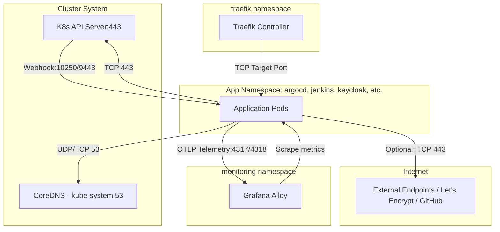

# Phase 9: Security Hardening — Pattern Mapping

This document maps out the design patterns, codebase analogs, roles, and traffic flows for all Kubernetes manifests and configuration files to be created or modified in Phase 9.

---

## 1. Classification of Target Files & Roles

To harden the AKS platform, we will configure Namespace policies, NetworkPolicies, resource bounds, GitOps application syncs, and Helm values for workloads.

### Class A: Namespace Definitions (Role: Security Admission Boundary)
These manifests define the target namespaces and enforce the required Pod Security Standard (PSS) at admission time.
* [namespace.yaml (argocd)](file:///Users/iemafzal-mac/Library/Mobile%20Documents/com~apple%20CloudDocs/Homelab/manifests/bootstrap/argocd/namespace.yaml) *(Created)*
* [namespace.yaml (cert-manager)](file:///Users/iemafzal-mac/Library/Mobile%20Documents/com~apple%20CloudDocs/Homelab/manifests/bootstrap/cert-manager/namespace.yaml) *(Created)*
* [namespace.yaml (jenkins)](file:///Users/iemafzal-mac/Library/Mobile%20Documents/com~apple%20CloudDocs/Homelab/manifests/bootstrap/jenkins/namespace.yaml) *(Created)*
* [namespace.yaml (keycloak)](file:///Users/iemafzal-mac/Library/Mobile%20Documents/com~apple%20CloudDocs/Homelab/manifests/bootstrap/keycloak/namespace.yaml) *(Created)*
* [namespace.yaml (oauth2-proxy-extras)](file:///Users/iemafzal-mac/Library/Mobile%20Documents/com~apple%20CloudDocs/Homelab/manifests/bootstrap/oauth2-proxy-extras/namespace.yaml) *(Created)*
* [namespace.yaml (k8s-monitoring)](file:///Users/iemafzal-mac/Library/Mobile%20Documents/com~apple%20CloudDocs/Homelab/manifests/bootstrap/k8s-monitoring/namespace.yaml) *(Created)*
* [namespace.yaml (traefik)](file:///Users/iemafzal-mac/Library/Mobile%20Documents/com~apple%20CloudDocs/Homelab/manifests/bootstrap/traefik/namespace.yaml) *(Created)*
* [namespace.yaml (cnpg)](file:///Users/iemafzal-mac/Library/Mobile%20Documents/com~apple%20CloudDocs/Homelab/manifests/bootstrap/cnpg/namespace.yaml) *(Created)*

### Class B: NetworkPolicies (Role: Network Segmentation & Zero-Trust Boundary)
These policies govern ingress/egress rules, isolating pods and allowing only verified traffic.
* [networkpolicy.yaml (argocd)](file:///Users/iemafzal-mac/Library/Mobile%20Documents/com~apple%20CloudDocs/Homelab/manifests/bootstrap/argocd/networkpolicy.yaml) *(Created)*
* [networkpolicy.yaml (cert-manager)](file:///Users/iemafzal-mac/Library/Mobile%20Documents/com~apple%20CloudDocs/Homelab/manifests/bootstrap/cert-manager/networkpolicy.yaml) *(Created)*
* [networkpolicy.yaml (jenkins)](file:///Users/iemafzal-mac/Library/Mobile%20Documents/com~apple%20CloudDocs/Homelab/manifests/bootstrap/jenkins/networkpolicy.yaml) *(Created)*
* [networkpolicy.yaml (keycloak)](file:///Users/iemafzal-mac/Library/Mobile%20Documents/com~apple%20CloudDocs/Homelab/manifests/bootstrap/keycloak/networkpolicy.yaml) *(Created)*
* [networkpolicy.yaml (oauth2-proxy-extras)](file:///Users/iemafzal-mac/Library/Mobile%20Documents/com~apple%20CloudDocs/Homelab/manifests/bootstrap/oauth2-proxy-extras/networkpolicy.yaml) *(Created)*
* [networkpolicy.yaml (k8s-monitoring)](file:///Users/iemafzal-mac/Library/Mobile%20Documents/com~apple%20CloudDocs/Homelab/manifests/bootstrap/k8s-monitoring/networkpolicy.yaml) *(Created)*
* [networkpolicy.yaml (traefik)](file:///Users/iemafzal-mac/Library/Mobile%20Documents/com~apple%20CloudDocs/Homelab/manifests/bootstrap/traefik/networkpolicy.yaml) *(Created)*
* [networkpolicy.yaml (cnpg)](file:///Users/iemafzal-mac/Library/Mobile%20Documents/com~apple%20CloudDocs/Homelab/manifests/bootstrap/cnpg/networkpolicy.yaml) *(Created)*

### Class C: LimitRanges (Role: Node Resource Quota Bounds)
These configurations specify default requests/limits for memory and CPU inside a namespace.
* [limitrange.yaml (argocd)](file:///Users/iemafzal-mac/Library/Mobile%20Documents/com~apple%20CloudDocs/Homelab/manifests/bootstrap/argocd/limitrange.yaml) *(Created)*
* [limitrange.yaml (cert-manager)](file:///Users/iemafzal-mac/Library/Mobile%20Documents/com~apple%20CloudDocs/Homelab/manifests/bootstrap/cert-manager/limitrange.yaml) *(Created)*
* [limitrange.yaml (jenkins)](file:///Users/iemafzal-mac/Library/Mobile%20Documents/com~apple%20CloudDocs/Homelab/manifests/bootstrap/jenkins/limitrange.yaml) *(Created)*
* [limitrange.yaml (keycloak)](file:///Users/iemafzal-mac/Library/Mobile%20Documents/com~apple%20CloudDocs/Homelab/manifests/bootstrap/keycloak/limitrange.yaml) *(Created)*
* [limitrange.yaml (oauth2-proxy-extras)](file:///Users/iemafzal-mac/Library/Mobile%20Documents/com~apple%20CloudDocs/Homelab/manifests/bootstrap/oauth2-proxy-extras/limitrange.yaml) *(Created)*
* [limitrange.yaml (k8s-monitoring)](file:///Users/iemafzal-mac/Library/Mobile%20Documents/com~apple%20CloudDocs/Homelab/manifests/bootstrap/k8s-monitoring/limitrange.yaml) *(Created)*
* [limitrange.yaml (traefik)](file:///Users/iemafzal-mac/Library/Mobile%20Documents/com~apple%20CloudDocs/Homelab/manifests/bootstrap/traefik/limitrange.yaml) *(Created)*
* [limitrange.yaml (cnpg)](file:///Users/iemafzal-mac/Library/Mobile%20Documents/com~apple%20CloudDocs/Homelab/manifests/bootstrap/cnpg/limitrange.yaml) *(Created)*

### Class D: ArgoCD Applications (Role: GitOps Sync Pipeline Configuration)
These manifests define which files in the repository sync to which namespaces, ensuring proper sequencing and pruning.
* [argocd-extras.yaml](file:///Users/iemafzal-mac/Library/Mobile%20Documents/com~apple%20CloudDocs/Homelab/manifests/apps/argocd-extras.yaml) *(Modified)*
* [cert-manager-extras.yaml](file:///Users/iemafzal-mac/Library/Mobile%20Documents/com~apple%20CloudDocs/Homelab/manifests/apps/cert-manager-extras.yaml) *(Modified)*
* [jenkins-extras.yaml](file:///Users/iemafzal-mac/Library/Mobile%20Documents/com~apple%20CloudDocs/Homelab/manifests/apps/jenkins-extras.yaml) *(Modified)*
* [traefik-extras.yaml](file:///Users/iemafzal-mac/Library/Mobile%20Documents/com~apple%20CloudDocs/Homelab/manifests/apps/traefik-extras.yaml) *(Created)*
* [monitoring-extras.yaml](file:///Users/iemafzal-mac/Library/Mobile%20Documents/com~apple%20CloudDocs/Homelab/manifests/apps/monitoring-extras.yaml) *(Created)*
* [cnpg-extras.yaml](file:///Users/iemafzal-mac/Library/Mobile%20Documents/com~apple%20CloudDocs/Homelab/manifests/apps/cnpg-extras.yaml) *(Created)*

### Class E: Helm Values (Role: Workload Security Context Parameters)
These values customize Helm releases, restricting runtime pod capabilities and permissions.
* [values.yaml (traefik)](file:///Users/iemafzal-mac/Library/Mobile%20Documents/com~apple%20CloudDocs/Homelab/manifests/bootstrap/traefik/values.yaml) *(Modified)*
* [values.yaml (jenkins)](file:///Users/iemafzal-mac/Library/Mobile%20Documents/com~apple%20CloudDocs/Homelab/manifests/bootstrap/jenkins/values.yaml) *(Modified)*
* [values.yaml (keycloak)](file:///Users/iemafzal-mac/Library/Mobile%20Documents/com~apple%20CloudDocs/Homelab/manifests/bootstrap/keycloak/values.yaml) *(Modified)*
* [values.yaml (oauth2-proxy)](file:///Users/iemafzal-mac/Library/Mobile%20Documents/com~apple%20CloudDocs/Homelab/manifests/bootstrap/oauth2-proxy/values.yaml) *(Modified)*
* [values.yaml (argocd)](file:///Users/iemafzal-mac/Library/Mobile%20Documents/com~apple%20CloudDocs/Homelab/manifests/bootstrap/argocd/values.yaml) *(Modified)*
* [values.yaml (k8s-monitoring)](file:///Users/iemafzal-mac/Library/Mobile%20Documents/com~apple%20CloudDocs/Homelab/manifests/bootstrap/k8s-monitoring/values.yaml) *(Modified)*

---

## 2. Security Boundaries & Traffic Flows



### Flow Descriptions
1. **Ingress Routing**: Traefik acts as the ingress proxy, routing traffic strictly to target HTTP/HTTPS ports (8080, 80, 8443) on internal platform applications.
2. **Monitoring**: Grafana Alloy scrapes metrics by calling targeted application pod endpoints.
3. **Telemetry Egress**: Workload pods push OTLP telemetry to Grafana Alloy on ports `4317` (gRPC) / `4318` (HTTP).
4. **DNS Name Resolution**: Every pod must be permitted to send UDP/TCP traffic on port 53 to CoreDNS in `kube-system`.
5. **External Connections (Internet)**: Only explicit pods (cert-manager, argocd, jenkins, monitoring) can initiate egress to ports 80/443 on the internet.
6. **Control Plane Admission**: The Kubernetes API Server must reach webhook endpoints (such as `cert-manager-webhook` on port `10250` and `cloudnative-pg` on port `9443`) for mutative actions.

---

## 3. Codebase Analogs & Excerpts

### Analog A: Namespace Manifests
The closest existing analog for a namespace declaration in the repository is found in [namespace.yaml (gpt-researcher)](file:///Users/iemafzal-mac/Library/Mobile%20Documents/com~apple%20CloudDocs/Homelab/manifests/apps/gpt-researcher/namespace.yaml):

```yaml
apiVersion: v1
kind: Namespace
metadata:
  name: gpt-researcher
  labels:
    name: gpt-researcher
```

**Mapping Pattern for Phase 9:**
We will append Pod Security Admission (PSA) labels to enforce the `baseline` standard. For example, for the `jenkins` namespace:
```yaml
apiVersion: v1
kind: Namespace
metadata:
  name: jenkins
  labels:
    name: jenkins
    pod-security.kubernetes.io/enforce: baseline
    pod-security.kubernetes.io/enforce-version: latest
    pod-security.kubernetes.io/warn: baseline
    pod-security.kubernetes.io/warn-version: latest
```

---

### Analog B: ArgoCD Application Extras
The existing Application manifests for extras (e.g., [argocd-extras.yaml](file:///Users/iemafzal-mac/Library/Mobile%20Documents/com~apple%20CloudDocs/Homelab/manifests/apps/argocd-extras.yaml)) restrict synced files using `directory.include`:

```yaml
apiVersion: argoproj.io/v1alpha1
kind: Application
metadata:
  name: argocd-extras
  namespace: argocd
spec:
  project: default
  source:
    repoURL: 'https://github.com/iemafzalhassan/homelab.git'
    targetRevision: HEAD
    path: manifests/bootstrap/argocd
    directory:
      include: '{argocd-httproute.yaml,servicemonitors.yaml}'
  destination:
    server: 'https://kubernetes.default.svc'
    namespace: argocd
```

**Mapping Pattern for Phase 9:**
Modified Application manifests will expand the `include` glob to capture `namespace.yaml`, `networkpolicy.yaml`, and `limitrange.yaml`.
For `argocd-extras.yaml`:
```yaml
    directory:
      include: '{namespace.yaml,networkpolicy.yaml,limitrange.yaml,argocd-httproute.yaml,servicemonitors.yaml}'
```

For new Application manifests (like `traefik-extras.yaml`), we will copy this exact structure, pointing to `manifests/bootstrap/traefik`:
```yaml
apiVersion: argoproj.io/v1alpha1
kind: Application
metadata:
  name: traefik-extras
  namespace: argocd
  finalizers:
    - resources-finalizer.argocd.argoproj.io
spec:
  project: default
  source:
    repoURL: 'https://github.com/iemafzalhassan/homelab.git'
    targetRevision: HEAD
    path: manifests/bootstrap/traefik
    directory:
      include: '{namespace.yaml,networkpolicy.yaml,limitrange.yaml,middleware-oauth2-proxy.yaml}'
  destination:
    server: 'https://kubernetes.default.svc'
    namespace: traefik
  syncPolicy:
    automated:
      prune: true
      selfHeal: true
```

---

### Analog C: Workload Helm Values (`values.yaml`)
Workload values files currently configure deployment properties like node selectors and tolerations.
Example from [values.yaml (jenkins)](file:///Users/iemafzal-mac/Library/Mobile%20Documents/com~apple%20CloudDocs/Homelab/manifests/bootstrap/jenkins/values.yaml#L13-L23):
```yaml
  ingress:
    enabled: false
  podLabels:
    azure.workload.identity/use: "true"
  nodeSelector:
    kubernetes.azure.com/scalesetpriority: "spot"
```

**Mapping Pattern for Phase 9:**
We will inject `podSecurityContext` and `containerSecurityContext` fields inside these configurations.
For Jenkins Controller:
```yaml
controller:
  podSecurityContext:
    runAsUser: 1000
    runAsGroup: 1000
    fsGroup: 1000
  containerSecurityContext:
    runAsNonRoot: true
    runAsUser: 1000
    runAsGroup: 1000
    allowPrivilegeEscalation: false
    readOnlyRootFilesystem: false # Required false due to active jenkins home writes
    capabilities:
      drop:
        - ALL
    seccompProfile:
      type: RuntimeDefault
```

---

## 4. Newly Introduced Design Patterns

### Pattern 1: Namespace NetworkPolicy Template
This pattern enforces default-deny ingress/egress, permits intra-namespace traffic, allows DNS resolution to CoreDNS, and allows egress to the Kubernetes API Server.

```yaml
apiVersion: networking.k8s.io/v1
kind: NetworkPolicy
metadata:
  name: namespace-security-policy
  namespace: <target-namespace>
spec:
  podSelector: {} # Selects all pods in this namespace
  policyTypes:
  - Ingress
  - Egress
  ingress:
  # Rule 1: Allow all intra-namespace traffic
  - from:
    - podSelector: {}
  egress:
  # Rule 1: Allow all intra-namespace traffic
  - to:
    - podSelector: {}
  # Rule 2: Allow DNS resolution to CoreDNS in kube-system
  - to:
    - namespaceSelector:
        matchLabels:
          kubernetes.io/metadata.name: kube-system
      podSelector:
        matchLabels:
          k8s-app: kube-dns
    ports:
    - port: 53
      protocol: UDP
    - port: 53
      protocol: TCP
  # Rule 3: Allow egress to Kubernetes API Server
  - to:
    - ipBlock:
        cidr: 0.0.0.0/0 # Scope to internet / API server IP if needed, or open TCP 443
    ports:
    - port: 443
      protocol: TCP
```

### Pattern 2: LimitRange Template
This pattern defines default container requests and limits when they are not declared in pod templates.

```yaml
apiVersion: v1
kind: LimitRange
metadata:
  name: default-limits
  namespace: <target-namespace>
spec:
  limits:
  - default:
      cpu: <limit-cpu>
      memory: <limit-memory>
    defaultRequest:
      cpu: <request-cpu>
      memory: <request-memory>
    type: Container
```
Values mapping based on **D-07**:
* `jenkins`: request `256Mi` / `100m`, limit `2Gi` / `1000m`
* `argocd`, `monitoring`, `keycloak`: request `256Mi` / `100m`, limit `1Gi` / `500m`
* `traefik`, `cert-manager`: request `64Mi` / `50m`, limit `256Mi` / `250m`
